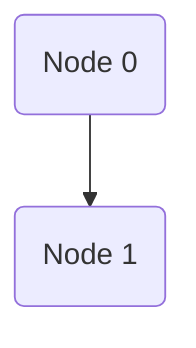
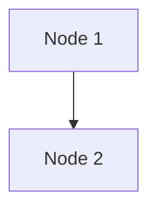
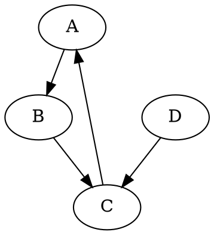
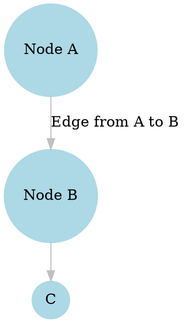

import Mermaid from "../../../components/Mermaid.astro";

## Supported Formats

SocNetV supports the following network data formats:

- **GraphML** (.graphml or .xml)
- **GML** (.gml or .xml)
- **GraphViz** (.dot)
- **Adjacency Matrix** (.sm, .adj, or .csv)
- **Pajek** (.net, .paj, or .pajek)
- **UCINET's Data Language** (.dl)
- **Edge List** (.lst or .list)
- **Weighted Lists** (.wlst or .wlist)

The default network data format for saving new networks is **GraphML**. 

If you create a new network and press `Ctrl+S` to save it, SocNetV will try to save it in GraphML format by default. 

:::note 
Pajek and UCINET support is not complete. Read below for more details.
:::


## Loading and Importing Files

- **GraphML** files can be loaded directly using `File > Load` or specified via the command line.
- For other formats, use `File > Import`.

---

## GraphML Format

GraphML is a highly versatile and widely adopted XML-based format designed for graph data representation. SocNetV supports both importing and exporting networks in GraphML format, making it an excellent choice for interoperability with other network analysis tools.

### Features of GraphML
- **XML-Based**: Uses XML structure to represent nodes, edges, and their attributes.
- **Custom Attributes**: Allows defining custom attributes for nodes and edges, such as labels, weights, or types.
- **Directed and Undirected Graphs**: Supports both directed and undirected graph structures.
- **Hierarchical Graphs**: Facilitates multi-level graph representations.

### Example GraphML File

Below is an example of a simple directed graph with two nodes and one edge:

```xml
<?xml version="1.0" encoding="UTF-8"?>
<graphml xmlns="http://graphml.graphdrawing.org/xmlns"
         xmlns:xsi="http://www.w3.org/2001/XMLSchema-instance"
         xsi:schemaLocation="http://graphml.graphdrawing.org/xmlns
                             http://graphml.graphdrawing.org/xmlns/1.0/graphml.xsd">
  <graph id="G" edgedefault="directed">
    <node id="n0" />
    <node id="n1" />
    <edge source="n0" target="n1" />
  </graph>
</graphml>
```

### Loading GraphML Files in SocNetV

To load a GraphML file in SocNetV:
1. Go to **File > Load**.
2. Select the desired `.graphml` file.
3. The network will be rendered on the canvas with all its nodes, edges, and attributes.

### Exporting to GraphML

To save a network as a GraphML file:
1. Go to **File > Save As**.
2. Choose the **GraphML** format from the list.
3. Specify the filename and save.

:::tip[Did you know?]
If you create a new network and press `Ctrl+S` to save it, SocNetV will try to save it in GraphML format by default. 
:::

### Visualization Example in GraphML

To better understand GraphML's capabilities, here is a visualization example using **Mermaid** syntax, which demonstrates a similar directed graph structure:


<Mermaid code={`graph TD; n0(Node 0) --> n1(Node 1);`} />

This illustrates how nodes (n0 and n1) and edges (directed from n0 to n1) appear in a graph visualization.

### Why Use GraphML?

- **Interoperability**: Works seamlessly with many other graph analysis tools, such as Gephi, Cytoscape, and yEd.
- **Customizability**: Flexible structure allows for defining extensive metadata.
- **Compatibility**: SocNetV ensures full compatibility with the GraphML standard, enabling smooth data exchange.

For more details about GraphML, refer to the official [GraphML documentation](http://graphml.graphdrawing.org/).


---

## GML (Graph Modelling Language)

The Graph Modelling Language (GML) is a popular file format for representing graph structures. GML is simple, human-readable, and supports the description of complex graphs with attributes assigned to nodes and edges.

### Features of GML
- **Human-readable**: GML files use a plain text format that is easy to read and understand.
- **Flexible**: It supports attributes for nodes and edges, making it versatile for various applications.
- **Hierarchical structure**: The format uses braces to represent the hierarchical organization of the graph elements.

### Example GML File
Below is an example of a small graph in GML format:

```plaintext
graph [
  directed 1
  node [
    id 1
    label "Node 1"
  ]
  node [
    id 2
    label "Node 2"
  ]
  edge [
    source 1
    target 2
    weight 1.0
  ]
]
```

### Explanation
- **`directed 1`**: Indicates that this is a directed graph. Use `0` for undirected graphs.
- **`node`**: Each `node` block defines a node with an ID and an optional label.
- **`edge`**: Each `edge` block defines a connection between a `source` node and a `target` node, with an optional `weight`.

### Using GML in SocNetV
SocNetV supports importing and exporting graphs in GML format. To use GML files:
1. Go to the **File** menu and select **Load Network**.
2. Choose a `.gml` file from your system and load it into SocNetV.
3. The graph will be visualized on the canvas, and you can perform analysis or layout adjustments.

### Visual Representation
Below is an example of the above GML graph visualized in SocNetV using the Kamada-Kawai layout:



This visual representation demonstrates how SocNetV renders a simple directed graph from a GML file.

### Advantages of GML
- Easy to understand and edit manually.
- Supported by many graph analysis tools, including SocNetV.
- Ideal for exchanging graph data between applications.


---


## GraphViz Format

GraphViz is a popular plain-text format for describing graphs. It is widely used due to its simplicity and compatibility with various visualization tools, including the GraphViz software itself. 

### How it Works

The GraphViz format represents graphs using a **DOT** language that describes nodes, edges, and their attributes. SocNetV supports importing graphs written in this format, allowing you to visualize and analyze them seamlessly.

### Basic Structure of a GraphViz File

A GraphViz file starts with the `graph` or `digraph` keyword, indicating whether the graph is undirected or directed. Inside curly braces `{}`, you define the graph’s structure, including nodes, edges, and optional attributes.

Here is an example of a simple directed graph in GraphViz format:



### Features of GraphViz Format in SocNetV

- **Directed and Undirected Graphs:** Easily load directed (`digraph`) or undirected (`graph`) GraphViz files.
- **Node and Edge Attributes:** SocNetV supports common attributes like labels, colors, and weights.
- **Compatibility:** SocNetV can handle both `.dot` and `.gv` extensions.

### Importing GraphViz Files in SocNetV

1. Go to `File` > `Import` in the SocNetV menu.
2. Select the `GraphViz` format from the dropdown.
3. Browse and select your `.dot` or `.gv` file.
4. Click `Open` to load the graph into the canvas.

### Example with Attributes



### Visualizing GraphViz Data in SocNetV

Once loaded, you can use SocNetV’s layout algorithms and analysis tools to explore your GraphViz graph. Modify node and edge properties, compute metrics, or apply layouts to better understand the network.


### Additional Resources

For more details on the GraphViz format, see the [GraphViz Documentation](https://graphviz.org/doc/info/lang.html).


---


## Adjacency Matrix Format

SocNetV supports the **Adjacency Matrix Format** as a means to load networks where the connections between nodes are represented in matrix form. In this format, each row and column corresponds to a node, and the entries in the matrix specify the weight or presence of an edge between the respective nodes.

### Format Structure

- Each line in the matrix corresponds to a row, and the entries are separated by spaces or tabs.
- The value at position `(i, j)` in the matrix represents the weight of the edge from node `i` to node `j`. For unweighted networks, use `1` for edges and `0` for no connection.
- Diagonal elements (self-loops) can be included but are not mandatory.
- Directed networks can be represented by an asymmetric adjacency matrix, where the entry `(i, j)` differs from `(j, i)`.

### Supporting Node Labels

In addition to numeric node identifiers, **SocNetV now supports labeled nodes**. This feature enables users to define custom node labels, making the matrix more descriptive. 
Labels can be provided as follows:

1. A header *comment* line at the top of the file lists the node labels, separated by spaces or tabs.
2. The subsequent rows represent the adjacency matrix, where the order of rows matches the order of node labels.

### Example 1: Numeric Node Identifiers

For a simple network:

```
0 1 0
1 0 1
0 1 0
```

- Node 1 is connected to Node 2.
- Node 2 is connected to both Node 1 and Node 3.
- Node 3 is connected to Node 2.

### Example 2: Labeled Nodes

Using labels instead of numeric identifiers:

```
# Alice Bob Carol
0 1 0
1 0 1
0 1 0
```

Here:
- `Alice` is connected to `Bob`.
- `Bob` is connected to both `Alice` and `Carol`.
- `Carol` is connected to `Bob`.

This format is especially useful for social networks where nodes represent entities like people, organizations, or websites, and meaningful labels enhance readability.

:::caution
- Ensure that the number of labels matches the number of rows and columns in the matrix.
:::

### Usage in SocNetV

To import an adjacency matrix into SocNetV:
1. Save the matrix in a plain text file.
2. Ensure that rows and columns are properly aligned with spaces or tabs.
3. Load the file through the **File > Import > Adjacency Matrix** menu option.

:::note
- SocNetV automatically detects whether the matrix is for a directed or undirected graph based on its symmetry.
- SocNetV will ask whether the input file contains labels based on the presence of a header comment line.
- Labels can be alphanumeric and should not contain spaces. If spaces are required in labels, encapsulate them in quotes (e.g., `"Node A"`).
- Ensure that the number of labels matches the number of rows and columns in the matrix.
:::


### Applications

The Adjacency Matrix Format is widely used in research and applications where the network structure is predefined, such as importing datasets from external tools or simulations. The inclusion of labels further enhances its versatility for descriptive and real-world social network data.


