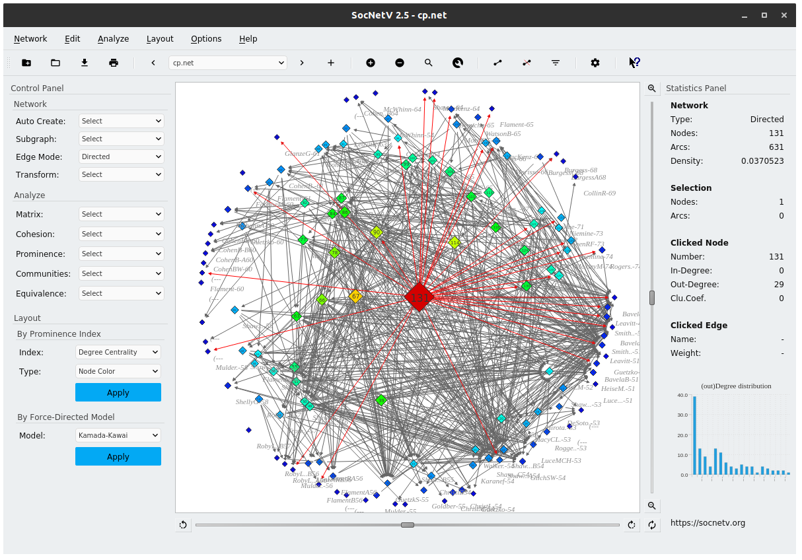

import BaseLayout from "../../layouts/BaseLayout.astro";
import { Card, CardGrid } from '@astrojs/starlight/components';
import Mermaid from "../../components/Mermaid.astro";

<BaseLayout title="Home" description="Welcome to SocNetV">

{/* title: "Welcome to Social Network Visualizer (SocNetV)"
description: "SocNetV is a cross-platform, user-friendly software for social network analysis and visualization. Learn about its features and how to contribute." */}

## Social Network Visualizer (SocNetV)

SocNetV is a cross-platform, user-friendly free software application for social network analysis and visualization. With SocNetV you can:

- [Draw social networks](../docs/index.md#canvas) with a few clicks on a virtual canvas, load field data from a file in a [supported format](../docs/formats.md) ([GraphML](../docs/formats.md#GraphML), [GraphViz](../docs/formats.md#GraphViz), Adjacency, EdgeList, GML, Pajek, UCINET, etc.), or crawl the internet to create a social network of connected webpages.
- Edit actors and ties through point-and-click, analyze graph and social network properties, produce beautiful HTML reports, and embed visualization layouts in the network.

### Main Features

- Standard graph and network cohesion metrics, such as [density](../docs/index.md#Cohesion), [diameter](../docs/index.md#Diameter), [geodesics](../docs/index.md#GeodesicsMatrix), [distances](../docs/index.md#DistancesMatrix), [connectedness](../docs/index.md#Connectedness), [eccentricity](../docs/index.md#Eccentricity), [clustering coefficient](../docs/index.md#Coefficient), reciprocity, etc.
- Matrix routines: Adjacency plot, Laplacian matrix, Degree matrix, Cocitation, etc.
- Advanced measures for social network analysis such as [centrality and prestige indices](../docs/index.md#Centralities) (e.g., [eigenvector centrality](../docs/index.md#EVC), [closeness centrality](../docs/index.md#CC), [betweenness centrality](../docs/index.md#BC), [information centrality](../docs/index.md#IC), [power centrality](../docs/index.md#PC), [proximity prestige](../docs/index.md#PP), and [pagerank prestige](../docs/index.md#PRP)).
- Fast algorithms for [community detection](../docs/index.md#communities), such as [triad census](../docs/index.md#TriadCensus), [clique census](../docs/index.md#CliqueCensus), etc.
- Structural equivalence analysis using [hierarchical clustering](../docs/index.md#hierarchicalclusteranalysis), actor similarities, tie profile dissimilarities, and Pearson coefficients.
- [Layout models](../docs/index.md#visualisation) based on prominence indices (e.g., circular, level, nodal sizes by centrality score) or on force-directed placement (e.g., Kamada-Kawai, [Fruchterman-Reingold](../docs/index.md#LayoutFR)).
- [Multirelational network loading and editing](../docs/index.md#Relations).
- Random network creation using various models ([Barabási–Albert Scale-Free](../docs/index.md#RandomSF), [Erdős–Rényi](../docs/generate.md#RandomER), [Watts-Strogatz Small-World](../docs/index.md#RandomSW), d-regular, ring lattice, etc.).
- [Famous social network analysis datasets](../docs/index.md#Datasets), such as Padgett's Florentine families.
- Built-in [web crawler](../docs/index.md#WebCrawler) to automatically create "social networks" from links found in a given URL.
- Comprehensive [documentation](../documentation) available both online and inside the application.

Source code, packages, and executables for Windows, Linux, and macOS are available on the [Downloads](../downloads) page.

The program is Free Software, licensed under the [GNU General Public License 3 (GPL3)](http://www.gnu.org/copyleft/gpl.html). You can copy or modify it, provided you keep the same license. The documentation is also free, licensed under the Free Documentation License (FDL).

---

## Do You Want to Contribute?

- If you are a C++/Qt developer, you can contribute by committing patches (new features or bug fixes) to our [source code](https://github.com/socnetv/app/tree/develop).
- If you are a SocNetV user, you can:
  - Report [bugs](../bugs) or propose new features in our [Issues](https://github.com/socnetv/app/issues).
  - Donate any amount to the project via the "Donate" button in the footer. Donations will redirect to our PayPal account.

Thank you for using and contributing to SocNetV! Have fun with social network analysis.

## Next steps
<CardGrid stagger>
	<Card title="Update content" icon="pencil">
		Edit `src/content/docs/index.mdx` to see this page change.

<Mermaid code={`graph TD; A-->B; B-->C; C-->D;`} />

	$$
E = mc^2
$$
	</Card>
	<Card title="Add new content" icon="add-document">
		Add Markdown or MDX files to `src/content/docs` to create new pages.
	</Card>
	<Card title="Configure your site" icon="setting">
		Edit your `sidebar` and other config in `astro.config.mjs`.
	</Card>
	<Card title="Read the docs" icon="open-book">
		Learn more in [the Starlight Docs](https://starlight.astro.build/).
	</Card>
</CardGrid>
</BaseLayout>

